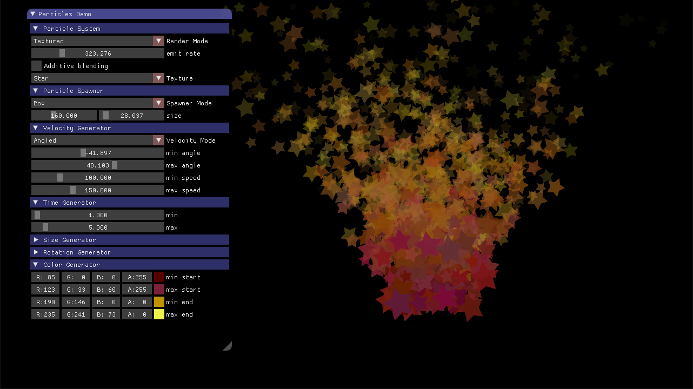
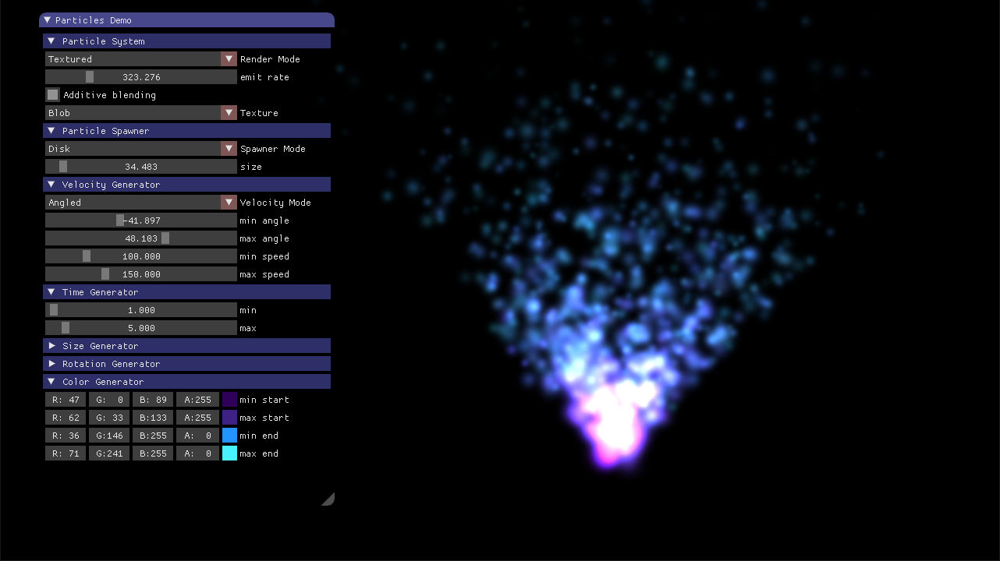
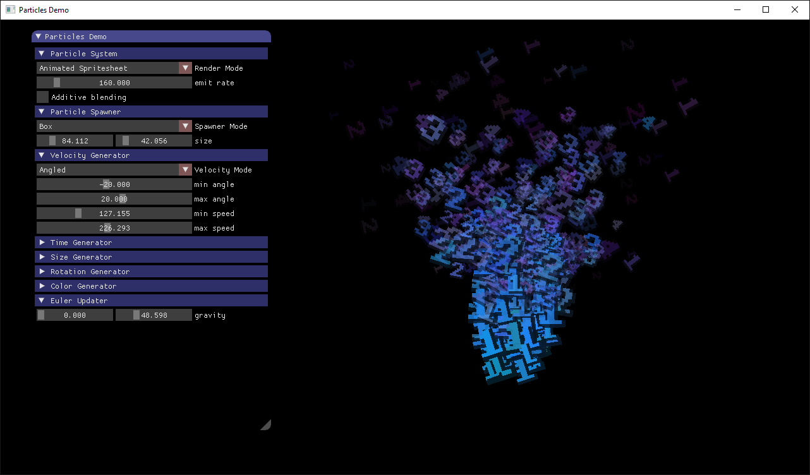
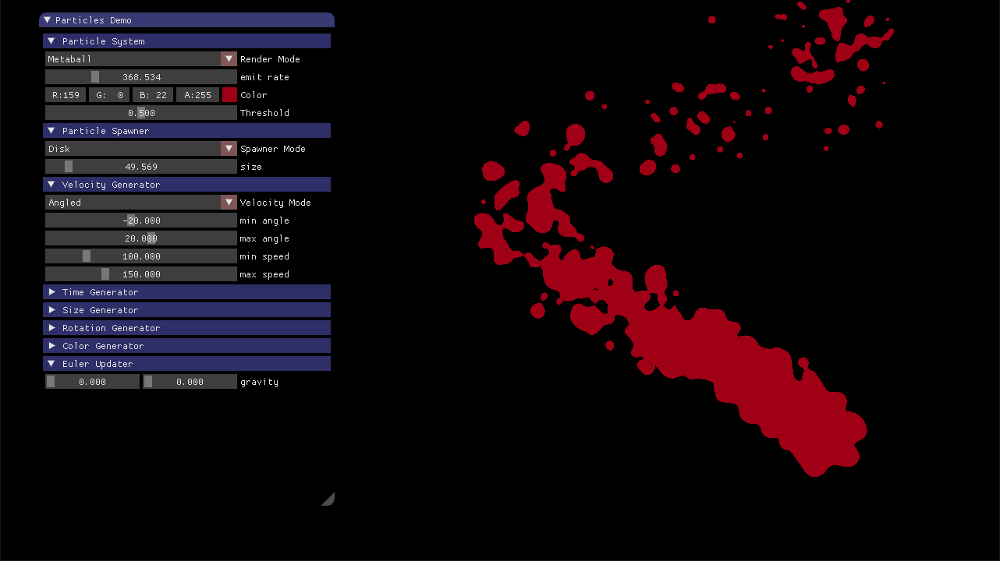

# Particles


Small library for 2D particle effects based on SFML.

There are three different rendering styles to choose from:
* Point based (single pixels only)
* Metaball rendering
* Texture based (using textured quads)
  * Static texture
  * Spritesheet
  * Animated spritesheet

## Usage

Particle systems are built with data-oriented design in mind. They are built out of different components that can be arbitrarily combined with each other. See below for an example setup.

Create and configure textured particle system:
```C++
int maxNumberParticles = 1000;
sf::Texture *texture = new sf::Texture();
texture->loadFromFile(".../path/to/texture.png");

particles::ParticleSystem *ps = new particles::TextureParticleSystem(maxNumberParticles, texture);
ps->additiveBlendMode = true;
ps->emitRate = 100.f; // particles per second
```

Add at least one particle spawner to define where particles are generated:
```C++
// Spawn particles at position (500, 500)
auto spawner = ps->addSpawner<particles::PointSpawner>();
spawner->center = sf::Vector2f(500.f, 500.f);
```

Add particle generators to define how particles look like.
Most updaters allow you to set 'start' and 'end' values to define the state at start and end of their lifetime, as well as 'min' and 'max' values to add randomness.
```C++
// Set particle lifetime to random value between 1 and 5 seconds
auto timeGenerator = ps->addGenerator<particles::TimeGenerator>();
timeGenerator->minTime = 1.f;
timeGenerator->maxTime = 5.f;

// Set random particle start and end sizes to interpolate between over their lifetime
auto sizeGenerator = ps->addGenerator<particles::SizeGenerator>();
sizeGenerator->minStartSize = 10.f;
sizeGenerator->maxStartSize = 30.f;
sizeGenerator->minEndSize = 20.f;
sizeGenerator->maxEndSize = 60.f;

// Set particle start velocity using a random direction and speed
auto velocityGenerator = ps->addGenerator<particles::AngledVelocityGenerator>();
velocityGenerator->minAngle = -5.f;
velocityGenerator->maxAngle = 5.f;
velocityGenerator->minStartSpeed = 10.f;
velocityGenerator->maxStartSpeed = 20.f;
```

Add particle updaters to change particle state over time.
```C++
// Update particle lifetime
ps->addUpdater<particles::TimeUpdater>();

// Interpolate particle size
ps->addUpdater<particles::SizeUpdater>();

// Update particle position using velocity and acceleration data
ps->addUpdater<particles::EulerUpdater>();
```

The memory allocated inside these calls is managed internally.

## Building

The recommended way to compile is using cmake. Don't forget to clone the repository with the `--recursive` flag to include the SFML dependency.

```
git clone https://github.com/tizian/particles.git --recursive
cd particles
mkdir build
cd build
cmake ..
make
```

Optionally, the `PARTICLES_BUILD_DEMO` cmake flag can be set to build a small demo application to experiment with the particle systems.
Alternatively, you can also simply copy the `Particles` folder with all source files to your SFML project.

## Used Libraries

* [SFML](http://www.sfml-dev.org/) : Window creation and rendering
* [dear imgui](https://github.com/ocornut/imgui): Used for demo application only
* [imgui-sfml](https://github.com/EliasD/imgui-sfml): SFML imgui bindings

## Acknowledgements

This library is inspired by a [tutorial series](http://www.bfilipek.com/2014/03/three-particle-effects.html) by Bartlomiej Filipek.
The Metaball rendering technique is described in [this tutorial](http://nullcandy.com/2d-metaballs-in-xna/) by NullCandy games.

## License

Particles is provided under the MIT License.

See the LICENSE.txt file for the conditions of the license.

## Screenshots


<p align="center">Point rendering</p>


<p align="center">Textured rendering</p>


<p align="center">Textured rendering with additive blend mode enabled</p>


<p align="center">Spritesheet texture</p>


<p align="center">Metaball rendering</p>