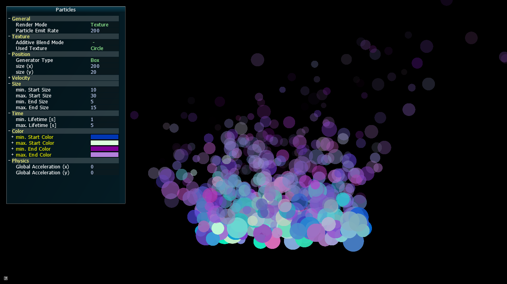
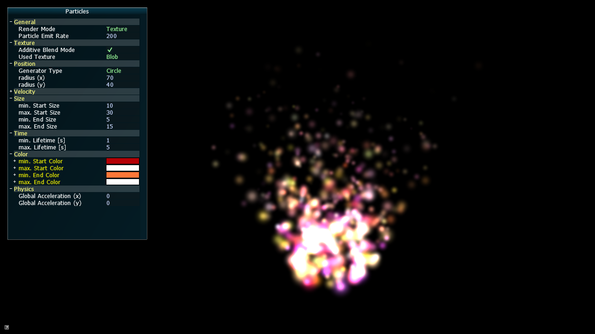
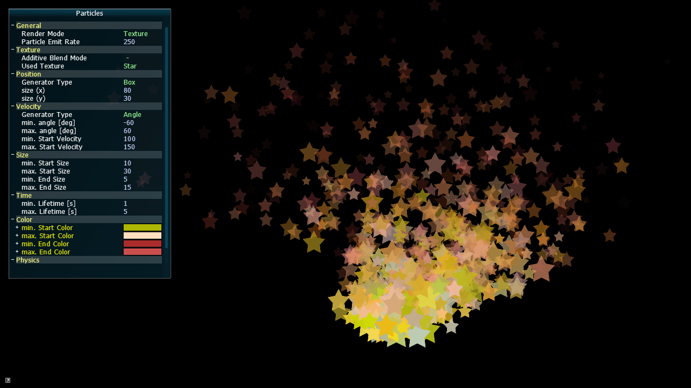

# Particles
Small application for experimenting with 2D particle effects.

There are three different rendering styles to choose from:
* Point based (single pixels only)
* Texture based (using textured quads)
* Metaball rendering


<p align="center">Textured rendering</p>

## Used Libraries

* SFML : Window creation and rendering
* AntTweakBar: GUI

## How to run

The recommended way to compile and run is using cmake.

If both required libraries are installed, running the application should be as simple as:
```
mkdir build
cd build
cmake ..
make
```
and
```
./particles/build/particles
```
Make sure to use the 'particles' root directory as your working directory when running the application.

If the libraries are not installed in standard paths, it might be necessary to set up `SFML_ROOT` and `ANT_TWEAK_BAR_ROOT` as either an environment or cmake variables, so that cmake can find them.

## Acknowledgements

The particle system is based on a [tutorial series](http://www.bfilipek.com/2014/03/three-particle-effects.html) by Bartlomiej Filipek.

The Metaball rendering technique is inspired by [this tutorial](http://nullcandy.com/2d-metaballs-in-xna/) by NullCandy games.


<p align="center">Textured rendering with additive blend mode enabled</p>


<p align="center">Metaball rendering</p>
