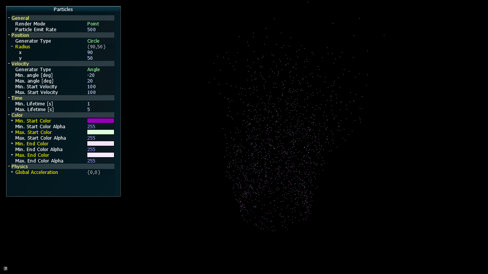
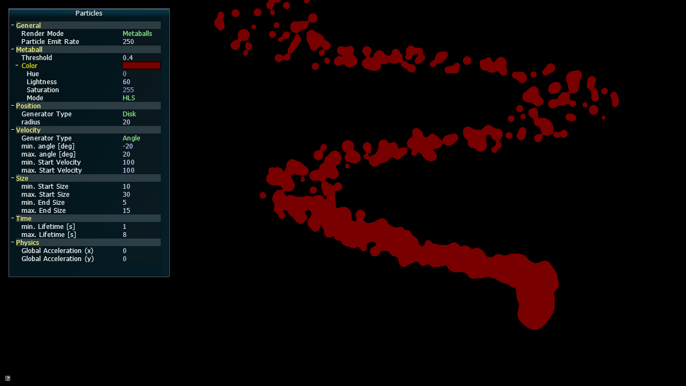
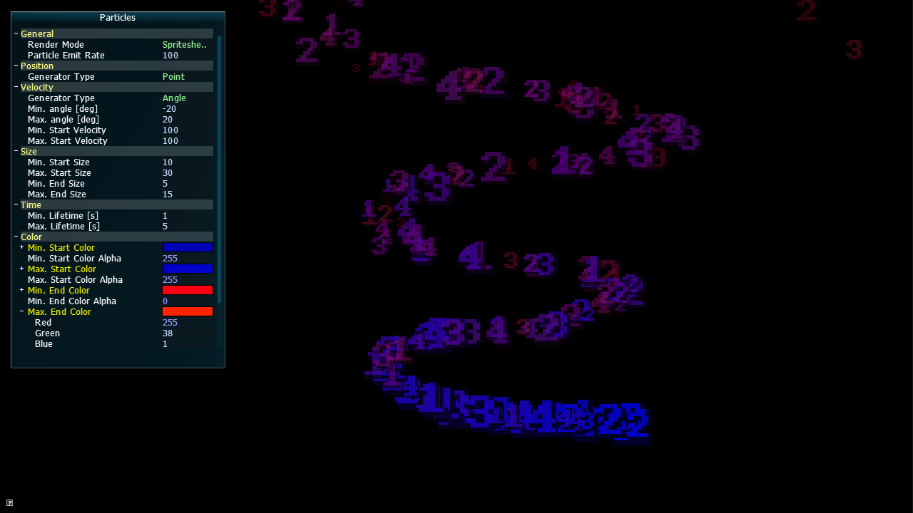

# Particles


Small library for 2D particle effects based on SFML.

There are three different rendering styles to choose from:
* Point based (single pixels only)
* Metaball rendering
* Texture based (using textured quads)
  * Static texture
  * Spritesheet
  * Animated spritesheet


## Building

The recommended way to compile is using cmake. Don't forget to clone the repository with all dependencies.

```
git clone https://github.com/tizian/particles.git --recursive
cd particles
mkdir build
cd build
cmake ..
make
```

Optionally, the `PARTICLES_BUILD_DEMO` cmake flag can be set to build a small demo application to experiment with the particle systems. Note that this requires the AntTweakBar library installed and `ANT_TWEAK_BAR_ROOT` either set as an environment variable or a cmake flag.

Alternatively, you can also simply copy the `Particles` folder with all source files to your SFML project.

## Used Libraries

* SFML : Window creation and rendering
* AntTweakBar: GUI (optional, used for demo application only)

## Acknowledgements

The particle system is based on a [tutorial series](http://www.bfilipek.com/2014/03/three-particle-effects.html) by Bartlomiej Filipek.

The Metaball rendering technique is inspired by [this tutorial](http://nullcandy.com/2d-metaballs-in-xna/) by NullCandy games.

## Screenshots


<p align="center">Point rendering</p>


<p align="center">Textured rendering</p>


<p align="center">Textured rendering with additive blend mode enabled</p>


<p align="center">Metaball rendering</p>


<p align="center">Spritesheet texture</p>
